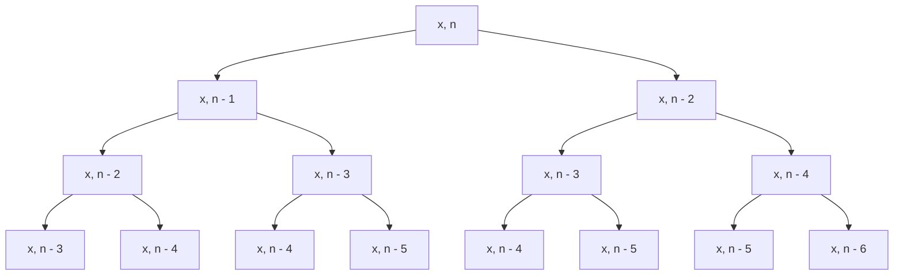

# **Bài tập 4**

---

## Tính hàm P~n~(x) đệ quy

```c++
#include <iostream>

long long int RecursiveCalculator(long long int, long long int);
void TestRecursiveCalculator();

long long int RecursiveCalculator(long long int x, long long int n)
{

    std::cout << "RecursiveCalculator(" << x << ", " << n << ")" << std::endl;

    if (n == 0)
        return 1;
    if (n == 1)
        return x;

    return RecursiveCalculator(x, n - 1) - RecursiveCalculator(x, n - 2);
}

void TestRecursiveCalculator()
{
    std::cout << "===================== TestRecursiveCalculator() =====================" << std::endl;

    long long int x, n;

    std::cout << "Enter x: ";
    std::cin >> x;

    do
    {
        std::cout << "Enter n: ";
        std::cin >> n;
    } while (n < 0);

    std::cout << "RecursiveCalculator(" << x << ", " << n << ") = " << RecursiveCalculator(x, n) << std::endl;
    std::cout << "====================================================================" << std::endl;
}

int main()
{
    TestRecursiveCalculator();
    return 0;
}
```

## Phân tích độ phức tạp

```c++
long long int RecursiveCalculator(long long int x, long long int n)
{

    std::cout << "RecursiveCalculator(" << x << ", " << n << ")" << std::endl; // Độ phức tạp O(1)

    if (n == 0) // Độ phức tạp O(1)
        return 1;
    if (n == 1) // Độ phức tạp O(1)
        return x;

    return RecursiveCalculator(x, n - 1) - RecursiveCalculator(x, n - 2);
    /*
    Độ phức tạp của hàm RecursiveCalculator(x, n) được tính bằng công thức:
    T(n) = T(n - 1) + T(n - 2) + O(1)

    Mỗi lời gọi hàm RecursiveCalculator(x, n) sẽ tạo ra 2 lời gọi hàm khác, nên số lần lời gọi hàm sẽ tăng theo cấp số nhân.

    Có thể thấy rằng hàm RecursiveCalculator(x, n) sẽ tạo ra một cây đệ quy với chiều sâu là n, mỗi node sẽ có 2 node con.

    Vậy số lần lời gọi hàm sẽ là 2^n.

    Độ phức tạp của hàm RecursiveCalculator(x, n) là O(2^n)

    */
}
```

## Cây đệ quy



> **Kết luận:** Độ phức tạp của hàm `RecursiveCalculator(long long int x, long long int n)` là O(2^n).
